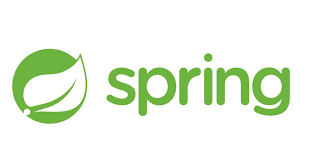

<h3 align='left' id="hi-i-m-mohammed-sharooque-sharooque7-https-komarev-com-ghpvc-username-sharooque7-label-profile-20views-color-0e75b6-style-flat-">Hi 👋, I&#39;m Mohammed Sharooque and you've reached my Dev space </h3>

###### I am a versatile software engineer with expertise in Java, Python, Kafka, PostgreSQL, and MongoDB. Currently, I specialize in stream processing, designing real-time solutions to handle and analyze high-velocity data streams efficiently. My passion lies in solving complex problems and creating scalable, impactful systems that drive business success. With a proven ability to work across diverse technologies and deliver innovative results, I bring both adaptability and a strong technical foundation to the table.

---

### About Me 🔭

- I am currently working on a data pipeline project that integrates real-time streaming with Kafka KStream and Flink, as well as batch processing using PySpark. The project focuses on efficient stream processing and real-time data insights for Conditional Monitoring System(CMS). [Stream](https://github.com/sharooque7/StreamProcessing)
- My roles and responsibilities include leading efforts designing innovative solutions. From brainstorming ideas to implementing actionable strategies, we take ownership of every stage, ensuring alignment with business goals and driving the successful implementation of data-driven initiatives.
- 🌱 Improving my understanding and knowledge on **System Design and Patterns** with practicals.
- 💬 Ask me about **Java, MERN, PostgreSql, Kafka, AWS, System Desing, DSA, Distributed Systems, IOT**

### Blogs 📝

- I regularly write articles on [Hashnode](https://sharooque.hashnode.dev/)
- [Setup and Integrating DocumentDB with JAVA](https://sharooque.hashnode.dev/integrating-amazon-documentdb-with-java-spring-boot-and-amazon-lambda)
- [Event Loop and Internals](https://sharooque.hashnode.dev/event-loop-in-node-js-and-its-internals)

### Profles

-  Hashnode

-  Leetcode
-  StackOverflow
-  LinkedIn
-  Codepen
-  Twitter

<h3 align="left">Languages and Tools:</h3>

 

---

### Github Stats and languages:

|  |  |
| ---------------------------------------------------------------------------------------------------------------------------------------------------------------------------------------------------------------------- | ------------------------------------------------------------------------------------------------------------------------------------------------------------------------------- |

### Streak and Contribution:

---

  

---

### Contact :iphone::point_down:

- 📫 Reach me **sharooquethoufiq@gmail.com**
- :point_right: Follow me [X](https://twitter.com/mosharooque).

---
